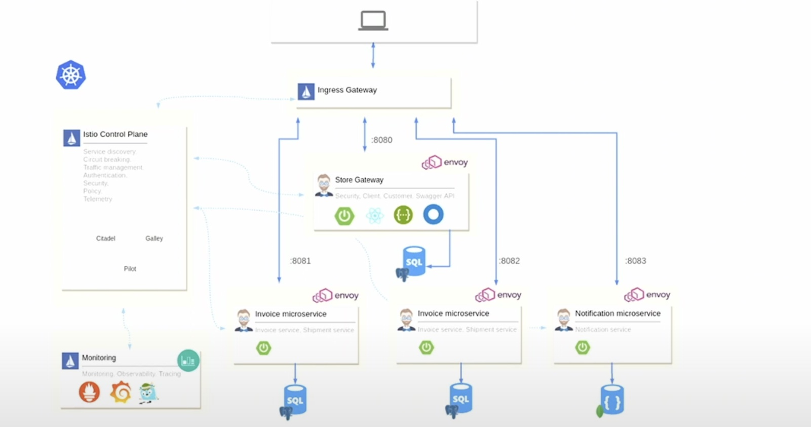

# Deploying a Full Stack Ecommerce Website on Kubernetes with Istio Service Mesh

Welcome to the deployment project for a full-stack Ecommerce website on Kubernetes using the powerful Istio Service Mesh. This project covers a wide range of topics, providing a comprehensive guide to deploying, managing, and securing microservices in a Kubernetes environment with Istio.

## Project Overview

In this project, I leverage Kubernetes to orchestrate the deployment of microservices that collectively form a robust Ecommerce website. Istio is my service mesh of choice, which is employed to enhance the capabilities of our microservices, focusing on key features such as:

### Traffic Management

- **Load Balancing:** Distribute incoming traffic evenly across microservice instances to optimize performance and resource utilization.
- **Canary Deployments:** Safely roll out new features by gradually introducing updates to a small subset of users before a full deployment.
- **A/B Testing:** Experiment with different versions of a microservice to gather insights into user preferences and performance metrics.
- **Fault Injections:** Simulate real-world failure scenarios to ensure system resilience and graceful degradation.

### Routing and Traffic Splits

- **Dynamic Routing:** Control and manage traffic flow between microservices based on custom routing rules.
- **Traffic Splits:** Gradually shift traffic between different versions of microservices to minimize the impact of changes.

### Timeouts, Circuit Breaking, and Retries

- **Timeouts:** Set response time limits for microservices to prevent slow or unresponsive components from affecting the entire system.
- **Circuit Breaking:** Implement mechanisms to prevent cascading failures by isolating problematic services.
- **Retries:** Handle transient failures gracefully by configuring the service mesh to retry failed requests.

## Security Implementations

As part of our commitment to security, the project delves into various Istio features aimed at securing our Ecommerce application:

- **Authentication:** Implement robust user authentication mechanisms to ensure that only authorized entities interact with our microservices.
- **Peer Authentication:** Enforce mutual TLS (mTLS) authentication between microservices for secure communication.
- **Request Authentication:** Protect endpoints by validating JWT tokens to ensure the legitimacy of incoming requests.
- **Authorization:** Control access to microservices based on predefined policies to enhance security.
- **Certificate Management:** Implement and manage SSL/TLS certificates for secure communication.

## Getting Started

Feel free to get started with this microservice architecture and play around with additional Istio features.

## Contributions

Contributions and feedback are welcome! If you encounter issues, have suggestions, or want to contribute, please feel free to open an issue or submit a pull request.

Let's build and deploy resilient, scalable, and secure Ecommerce applications together! 🚀
